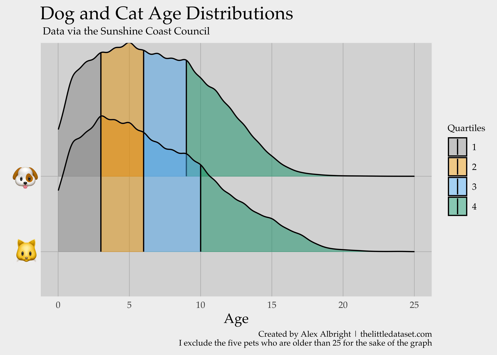

# The Data

"[T]he Sunshine Coast Council, in Australia, publishes a spreadsheet of both dogs and cats, their primary breeds and colors, and whether they’ve been spayed/neutered." (h/t [Data is Plural](https://tinyletter.com/data-is-plural))

Let's download this data. It is available [here](https://data.sunshinecoast.qld.gov.au/Administration/Registered-Animals/7f87-i6kx/data)! I download the csv and then open it up.

```{r}
pets<- read.csv('Registered_Animals.csv')
levels(pets$AnimalType)
```
There are spaces in the `AnimalType` variable. We remove them now.
```{r}
library(stringr)
pets$AnimalType<-str_trim(as.character(pets$AnimalType))
pets$AnimalType[pets$AnimalType=="D"]<-"Dog"
unique(pets$AnimalType)
```

```{r}
nrow(pets)
nrow(subset(pets, AnimalType=="Cat"))
nrow(subset(pets, AnimalType=="Dog"))
```
There are 55,495 animals registered with the sunshine council in Australia, 9,412 are cats and 46,083 are dogs. So, there are almost 5 times as many dogs as cats in Australia.

I wonder if some of these animals could be deceased.^[[Pets do die.](https://www.youtube.com/watch?v=7VzaL4CSfms&feature=youtu.be&t=54)] I look into the [Sunshine Coast Website](https://www.sunshinecoast.qld.gov.au/Pay-and-Apply/Cat-and-Dog-Registration/Registration-Renewals) and see that "[d]og registrations must be renewed annually as per the Animal Management (Cats & Dogs) Act 2008 Queensland. Cat registrations must be renewed annually as per the Sunshine Coast Local Law No. 2 (Animal Management) 2011." So, all animals in the dataset have been "renewed" within the last year, meaning this is a dataset of "active animals." (I.e., they were alive at some point this year.)

# Names

## Most Popular 

Let's figure out the most popular pet names in Australia.

```{r, message=FALSE, warning=FALSE}
# List top 5 cat names...
pets$Name<-tolower(pets$Name)
library(dplyr)

petnames<- pets %>%
     group_by(Name, AnimalType) %>%
     summarise(num=n()) %>% 
     arrange(desc(num))
petnames[1:5,]
```

**Top 5 dog names: bella, charlie, molly, max, buddy**

```{r, message=FALSE, warning=FALSE}
# List top 5 cat names...
subset(petnames, petnames$AnimalType=="Cat")[1:5,]
```

**Top 5 cat names: bella, charlie, molly, max, mia**

So, in summary:

Top 5 Cat Names | Top 5 Dog Names
------------- | -------------
Bella         | Bella
Charlie       | Charlie 
Molly           | Molly
Max         | Max
Mia         | Buddy


Overall, Bella obviously a popular name in [NYC for dogs too](http://a816-dohbesp.nyc.gov/IndicatorPublic/dognames/). And [for humans...](http://www.wolframalpha.com/input/?i=bella) I guess Twilight took the animal kingdom as well as humans by storm!

## Most dog-y/cat-y names (using `tf-idf`)

Since lots of the top names are the same for dogs and cats, it would be more interesting to see which are most uniquely cat-y or dog-y names.

```{r, message=FALSE, warning=FALSE}
library(tidytext)
petnames1 <- petnames %>%
  bind_tf_idf(Name, AnimalType, num)

pettf<- petnames1 %>% 
  arrange(desc(tf_idf))

subset(pettf, pettf$AnimalType=="Cat")[1:5,]
```

**The top 5 cat-y names are: puss, mittens, garfield, meow, salem**

```{r}
subset(pettf, pettf$AnimalType=="Dog")[1:5,]
```

**The top 5 dog-y names are: hudson, dozer, bronson, chopper, yogi**

So, in summary:

Top 5 Cat-y Names | Top 5 Dog-y Names
------------- | -------------
Puss          | Hudson 
Mittens       | Dozer 
Garfield      | Bronson
Meow          | Chopper
Salem         | Yogi

# Age

Let's see who the oldest animals are...

```{r}
pets[order(-pets$Age),]
```

71, 52, 42, 31, 28,... *are these ages for real???!!!* 

## How does the age distribution differ across the dog and cat populations?

I will use my regular theme for styling.^[I promise I'll eventually make a package for this.]
```{r, message=FALSE, warning=FALSE}
library(ggplot2);library(ggrepel); library(extrafont); library(ggthemes);library(reshape);library(grid);
library(scales);library(RColorBrewer);library(gridExtra);

my_theme <- function() {

  # Define colors for the chart
  palette <- brewer.pal("Greys", n=9)
  color.background = palette[2]
  color.grid.major = palette[4]
  color.panel = palette[3]
  color.axis.text = palette[9]
  color.axis.title = palette[9]
  color.title = palette[9]

  # Create basic construction of chart
  theme_bw(base_size=9, base_family="Palatino") + 

  # Set the entire chart region to a light gray color
  theme(panel.background=element_rect(fill=color.panel, color=color.background)) +
  theme(plot.background=element_rect(fill=color.background, color=color.background)) +
  theme(panel.border=element_rect(color=color.background)) +

  # Format grid
  theme(panel.grid.major=element_line(color=color.grid.major,size=.25)) +
  theme(panel.grid.minor=element_blank()) +
  theme(axis.ticks=element_blank()) +

  # Format legend
  theme(legend.position="right") +
  theme(legend.background = element_rect(fill=color.background)) +
  theme(legend.text = element_text(size=8,color=color.axis.title)) + 
  theme(legend.title = element_text(size=8,color=color.axis.title)) + 
  
  #Format facet labels
  theme(strip.text.x = element_text(size = 8, face="bold"))+

  # Format title and axes labels these and tick marks
  theme(plot.title=element_text(color=color.title, size=28)) +
  theme(axis.text.x=element_text(size=8)) +
  theme(axis.text.y=element_text(size=8)) +
  theme(axis.title.x=element_text(size=12)) +
  theme(axis.title.y=element_text(size=8)) +

  #Format title and facet_wrap title
  theme(strip.text = element_text(size=8), plot.title = element_text(size = 16, colour = "black", vjust = 1, hjust=0))+
    
  # Plot margins
  theme(plot.margin = unit(c(.2, .2, .2, .2), "cm"))
}
```
Make the plot. Let's use `ggridges`. See [here.](https://cran.r-project.org/web/packages/ggridges/vignettes/introduction.html)
```{r, message=FALSE, warning=FALSE}
library(ggridges); library(ggplot2)

# The palette with grey:
cbPalette <- c("#999999", "#E69F00", "#56B4E9", "#009E73", "#F0E442", "#0072B2", "#D55E00", "#CC79A7")

ggplot(pets, aes(x=Age, y=AnimalType, fill=factor(..quantile..))) +
  stat_density_ridges(
    geom = "density_ridges_gradient", calc_ecdf = TRUE,
    quantiles = 4, quantile_lines = TRUE, alpha = 0.7) +
  scale_x_continuous(limits=c(0,25))+ 
  scale_fill_manual(values=alpha(cbPalette, .5), name = "Quartiles")+
  my_theme()+ labs(y="", x="Age", caption="Created by Alex Albright | thelittledataset.com\nI exclude the five pets who are older than 25 for the sake of the graph")+
  ggtitle("Dog and Cat Age Distributions", subtitle=" Data via the Sunshine Coast Council") 

ggsave("dog_cat_ages.png", width = 6, height = 4.3, dpi = 800)
```
This is a ridgeline plot that uses data densities. I.e., it's two density plots put over one another.

The quartiles really highlight how similar the distributions are. These density plots show that dog and cat lifespans look pretty similar, which I didn't realize before!

Put emojis for cat/dog in :)
```{r}
library(magrittr);library(magick)

# Now call back the plot
background <- image_read("dog_cat_ages.png")
# And bring in a zipper emoji
cat_raw <- image_read("cat.png")
cat <- cat_raw %>%
  image_scale("250") 
dog_raw <- image_read("dog.png")
dog <- dog_raw %>%
  image_scale("250") 
new<-image_composite(background, dog, offset = "+120+1580")
new1<-image_composite(new, cat, offset = "+130+2300")
image_write(new1, "dog_cat_ages_final.png", flatten = F)
```

Here is the final graphic.


## How do pet ages compare to human ages?

From [a 2008 WSJ article](https://www.wsj.com/articles/SB121997338176882143):

> Somewhere along the way, it seems likely to several veterinarians, typical lifespans were pegged at about 70 for humans and about 10 for dogs. Thus, the seven-year rule was born. "My guess is it was a marketing ploy," says William Fortney, a veterinarian at Kansas State University, "a way to educate the public on how fast a dog ages compared to a human, predominantly from a health standpoint. It was a way to encourage owners to bring in their pets at least once a year."

From [a priceonomics article](https://priceonomics.com/the-mythology-of-dog-years/):

> Yet because there is no canine equivalent to the National Center for Health Statistics, we rely on a triage of sources for their lifespan data: pet insurance companies, breed-club surveys, and veterinary hospitals. As Carl Bialik of the WSJ notes, these sources often provide inaccurate, skewed results. Dogs who have insurance, for instance, are generally more likely to live longer lives. Surveys, which often require owners to guesstimate their pets’ ages, yield inflated numbers.

With this complete data on registered dogs in Australia, we could compare summary statistics across dog and human ages therein. Let's compare median ages (rather than life expectancy because I can't see deaths for the dogs and I don't want to get into life expectancy calculations -- see more [here](https://ourworldindata.org/life-expectancy-how-is-it-calculated-and-how-should-it-be-interpreted)).

[Australian Bureau of Statistics](http://www.abs.gov.au/ausstats/abs@.nsf/featurearticlesbyCatalogue/CCF53AA000E69954CA2582570013F5C6?OpenDocument) says the median age for Australian is 37, as of June 30, 2017.

What are the median ages for dogs and cats?
```{r}
median(subset(pets, AnimalType="D")$Age)
median(subset(pets, AnimalType="Cat")$Age)
```
The median dog age for Australian dogs is 6. 
So, 
```{r}
37/6
```

So $dog_{median} \times 6 \approx human_{median}$.

Assuming we want to match on medians, dog-years (in Australia at least) are 6.166667 rather than 7 years.

---